# Telco Customer Churn — Decision Trees, Random Forest & XGBoost

**🚀 Live Demo:** _[link coming after deployment]_

Predicts which telecom customers are likely to churn (cancel their service), explains *why* the model thinks so for any individual customer, and ships as an interactive app — not just a notebook.

This project is part of an ongoing portfolio built alongside Andrew Ng's Machine Learning Specialization, one project per algorithm. It follows decision trees and ensemble methods, and was built in three phases: **exploration notebook → modular PyCharm project → deployed Streamlit app**.

---

## 📓 Notebook Highlights

The full exploration lives in `notebooks/churn_eda.ipynb` — every step from raw data to a tuned, explained model, with the reasoning behind each decision written out as it was made. A few highlights:

### Churn Rate by Contract Type
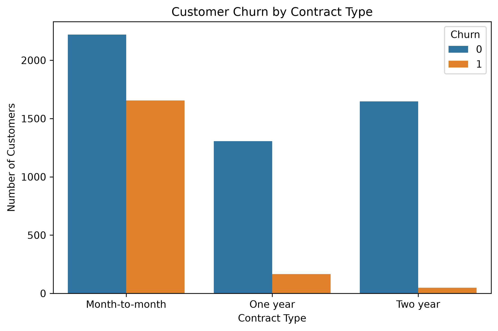
_The single clearest signal in the data: month-to-month customers churn at a dramatically higher rate than those on a one- or two-year contract — this is the feature every model ends up splitting on first._

### Class Balance
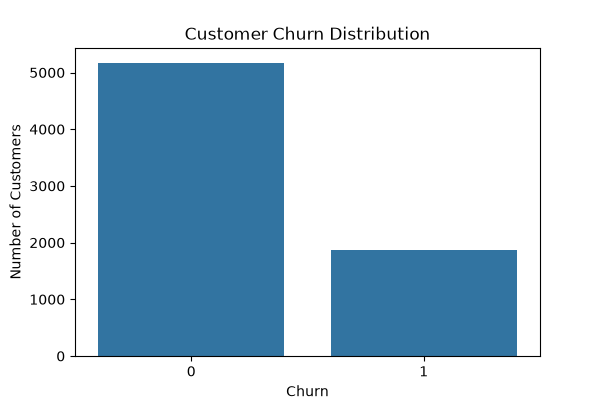
_About 73% of customers don't churn. A model that always predicts "stayed" would already be ~73% accurate while being completely useless — the reason this project evaluates with F1, ROC-AUC and PR-AUC instead of accuracy._

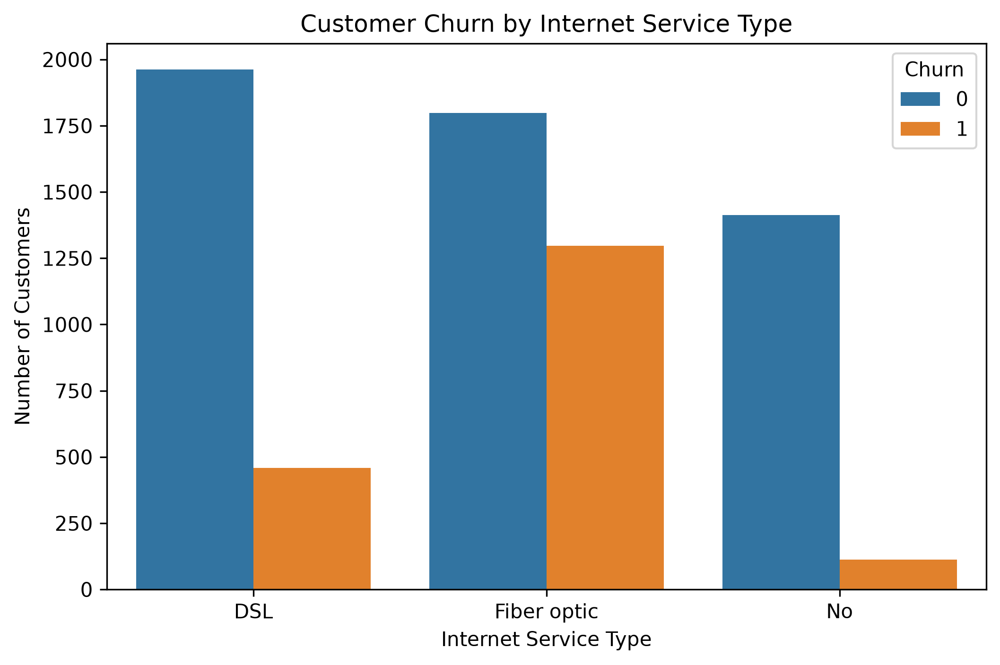

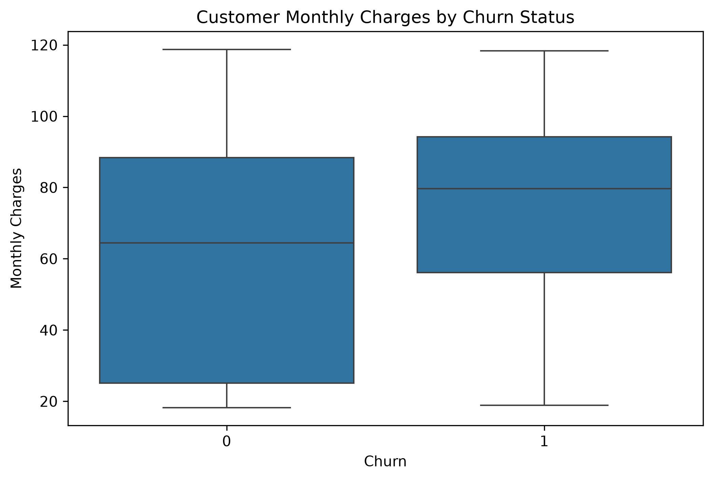

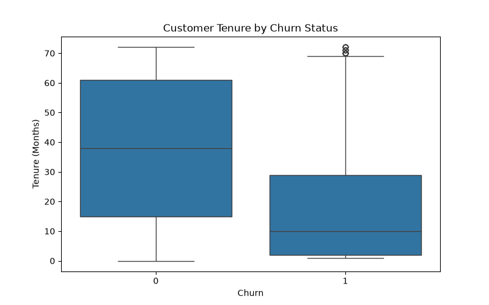

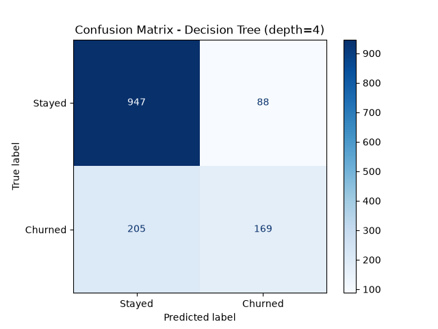

### Decision Tree Visualization
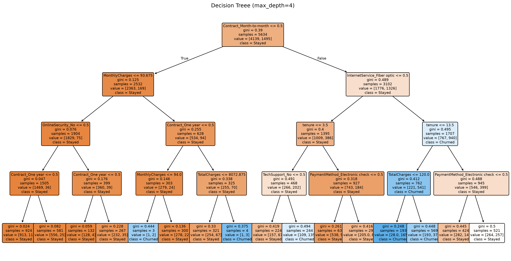
_The actual learned tree at a shallow depth, readable question by question — the same information-gain logic implemented by hand in Andrew Ng's lab, here fit by `scikit-learn` in milliseconds._

### Feature Importance
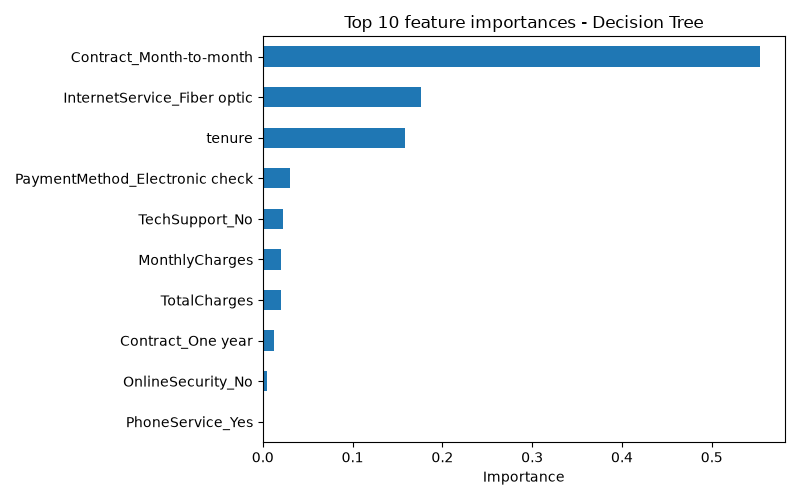
_Which features the tree relied on most, summed across every split — contract type and tenure dominate, consistent with the EDA._

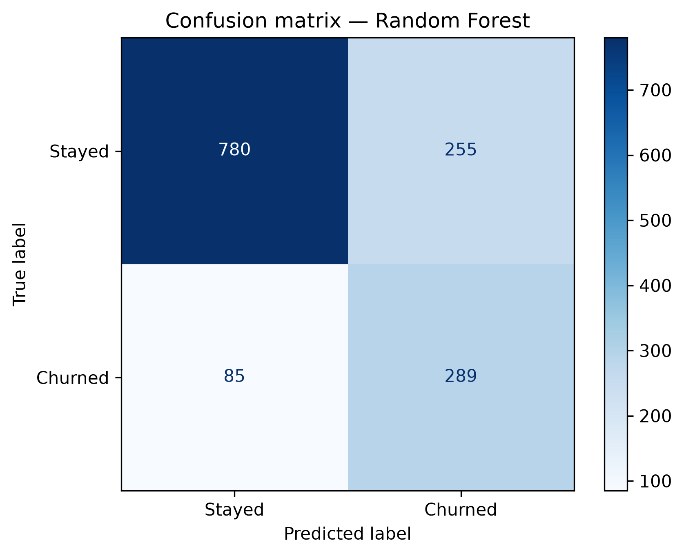

### Model Comparison — ROC & Precision-Recall Curves
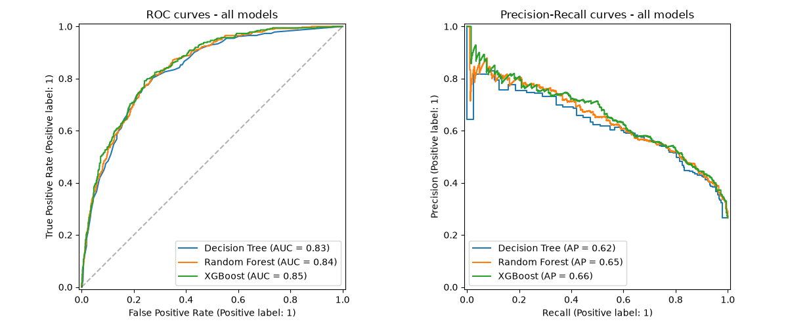
_Decision Tree, Random Forest, and XGBoost evaluated on the same held-out test set. XGBoost sits highest on both curves, though the margin over Random Forest is modest._

### SHAP Global Feature Importance
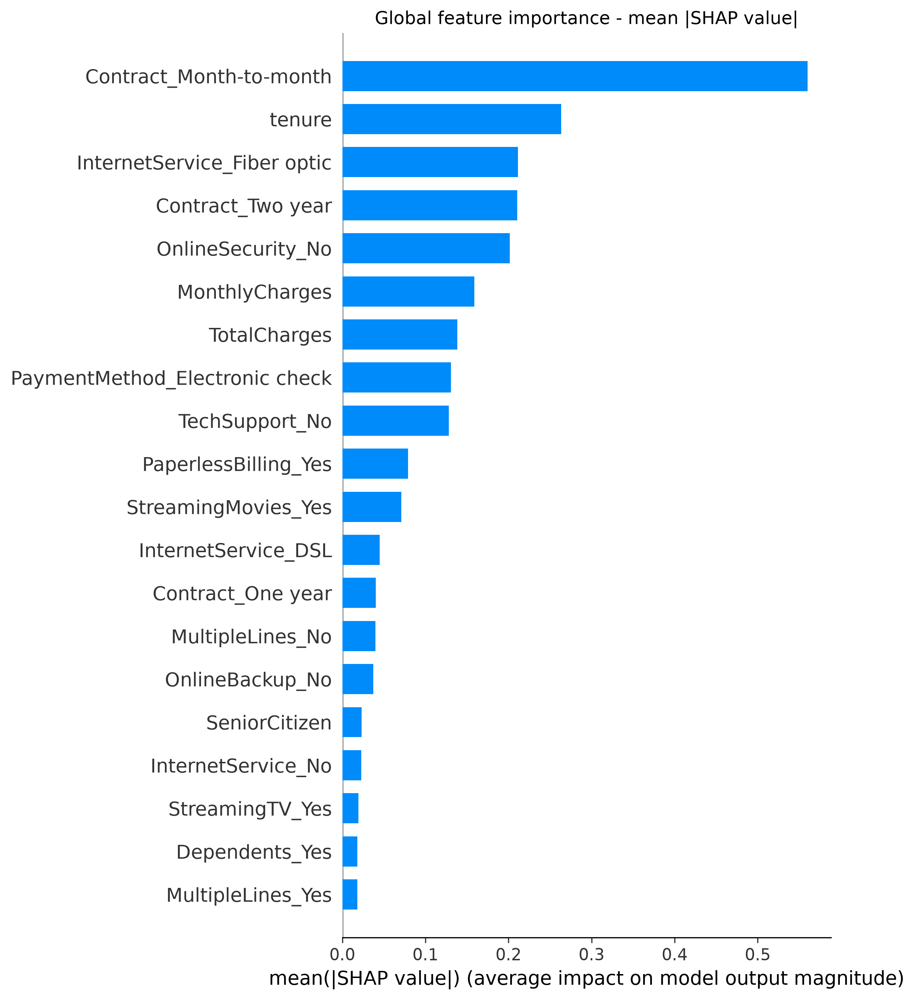
_Beyond raw importance: this shows **direction**, not just magnitude. Red dots (high tenure) cluster on the left — high tenure consistently pushes predictions *away* from churn, something a plain importance score can't say._

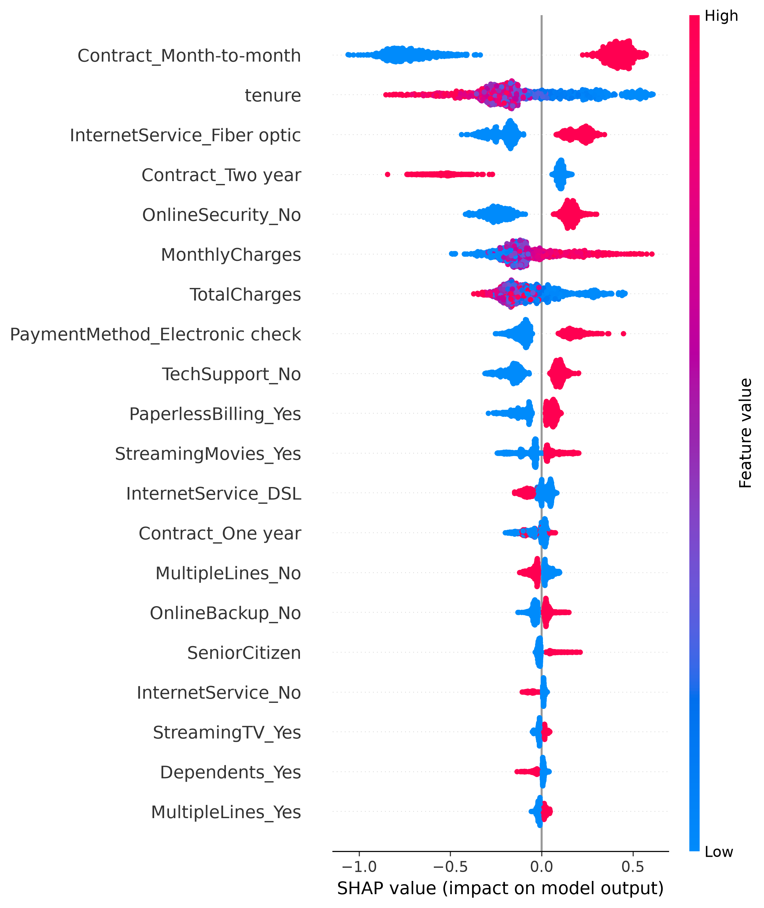


### SHAP Waterfall — One Customer, Explained
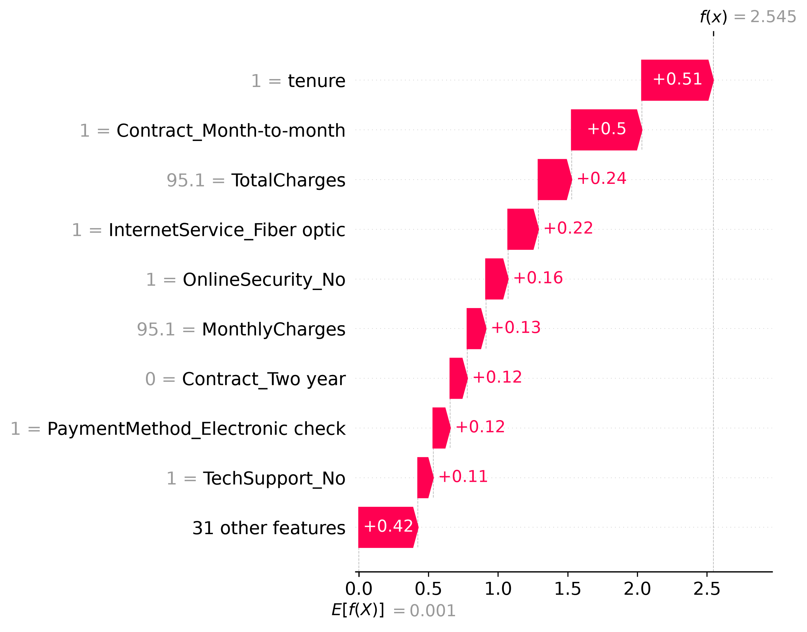
_Why the model flagged its highest-risk test customer: short tenure and a month-to-month contract each push the prediction up, step by step, from the baseline to the final 92.7% churn probability — a number that reconstructs exactly from these contributions._

---

## Dataset

[Telco Customer Churn](https://www.kaggle.com/datasets/blastchar/telco-customer-churn) (Kaggle, `blastchar/telco-customer-churn`) — 7,043 customers, 20 features after cleaning, target `Churn` (Yes/No).

## Project Structure

```
churn_prediction/
├── app.py                         # Streamlit home page (KPIs, model status)
├── app_common.py                  # shared app logic: cached loading, input widgets, risk categorization
├── pages/
│   ├── 1_🔮_Predict.py             # single customer prediction + SHAP waterfall + history
│   ├── 2_🎚️_What_If.py             # sensitivity analysis: tenure & contract levers
│   ├── 3_📂_Batch_Upload.py        # CSV upload → risk leaderboard
│   └── 4_📊_Compare_Models.py      # live model comparison, confusion matrix, ROC/PR curves
├── .streamlit/
│   └── config.toml                # app theme
├── data/                          # WA_Fn-UseC_-Telco-Customer-Churn.csv
├── models/                        # saved pipelines + metadata.json (all 3 models, not just the winner)
├── notebooks/
│   └── churn_eda.ipynb            # the full exploration, step by step
├── src/
│   ├── config.py                  # paths, constants, risk thresholds
│   ├── data.py                    # load + clean (training) / prepare_for_inference (app)
│   ├── features.py                # preprocessing (ColumnTransformer)
│   ├── train.py                   # cross-validated tuning for all 3 models, via full Pipeline search
│   ├── evaluate.py                # test-set metrics, comparison table, model selection, plots
│   └── explain.py                 # SHAP: global importance + per-customer explanations
├── tests/
│   └── test_data.py               # pytest for the cleaning logic
├── main.py                        # runs the full training pipeline end to end
├── requirements.txt
└── README.md
```

## Setup

1. Create a virtual environment and install dependencies:
   ```
   pip install -r requirements.txt
   ```
2. Download the dataset from Kaggle and place the CSV in `data/`.
3. Train all three models:
   ```
   python main.py
   ```
   This saves every tuned pipeline individually to `models/` (not just the winner), plus `metadata.json` with the real test-set metrics — both the notebook and the app read from these.

## Usage

**Run the app:**
```
streamlit run app.py
```

**Run the tests:**
```
pytest
```

**Explore the modelling process step by step**, including SHAP explanations of individual predictions:
```
jupyter notebook notebooks/churn_eda.ipynb
```

---

## 🔬 Methodology (Phase 1 — Notebook)

1. **Cleaning.** `TotalCharges` loaded as text because a handful of rows were blank; investigating (rather than dropping immediately) showed every blank belonged to a customer with `tenure == 0` — brand-new customers who hadn't been billed yet. Filled with 0 rather than removed, keeping those customers and letting the model see what a new signup looks like. `customerID` dropped (unique per row, nothing to learn); `Churn` mapped to 0/1.
2. **Exploration.** Class balance checked first (≈27% churn) — the reason this project never leans on plain accuracy. Churn rate by category and numeric-feature-by-churn plots done before any modelling, to build intuition for what a tree is likely to split on.
3. **Split.** Stratified 80/20 train/test split, so both sets keep the same churn ratio — important with imbalanced classes. The test set is touched exactly once per model, after tuning is complete.
4. **Encoding.** Numeric features pass through unchanged (trees need no scaling); categorical features one-hot encoded via a `ColumnTransformer`, fit on training data only, to avoid leaking test-set categories into training.
5. **Three models, one methodology.** Decision Tree, Random Forest, and XGBoost each tuned via cross-validated search (`GridSearchCV` / `RandomizedSearchCV`), scored on **F1 for the churned class** — not accuracy, and not a single train/test split, since cross-validation is less sensitive to which rows happened to land in which fold. Class imbalance handled via `class_weight="balanced"` (tree, forest) and `scale_pos_weight` (XGBoost).
6. **The precision/recall tradeoff, made deliberately.** Tuning consistently pushed recall up at the cost of precision. For churn prevention, a missed churner (false negative) is a customer who leaves with zero chance of intervention; a false alarm just costs an unnecessary retention email. That asymmetry — not a default — is why recall was prioritized.
7. **Explainability.** SHAP (`TreeExplainer`) used for two things: a global view (which features matter most, and in which direction) and a per-customer waterfall (why *this* customer got *this* probability). The waterfall's reconstructed probability is verified to match the model's own `predict_proba` to three decimal places — not just a plot, a confirmed-correct one.

## 🏗️ Software Engineering (Phase 2 — PyCharm)

The notebook's logic was refactored into an importable `src/` package rather than left as one long script:

- **Pipelines tuned end-to-end.** Rather than tuning a bare classifier on pre-encoded data and separately wrapping it in a `Pipeline` afterward, every `tune_*` function in `train.py` searches over the **full pipeline** (preprocessing + classifier together) using scikit-learn's `step__param` syntax. `search.best_estimator_` comes out already a complete, fitted pipeline — no manual "does this match the hand-built version" check needed.
- **All three models persisted, not just the winner.** `main.py` saves every tuned pipeline individually, so later consumers (the app's model-comparison and model-switching features) can load any of them.
- **Defensive, not just functional, code.** `data.py`'s cleaning function asserts the tenure-0 assumption rather than silently applying it — if a future dataset violates it, cleaning fails loudly instead of quietly producing a wrong value.
- **Tested.** `tests/test_data.py` covers the cleaning logic in isolation (blank-charge handling, the assertion firing correctly, `customerID` dropping, the Yes/No → 1/0 mapping) — fast checks that don't require running the full training pipeline.
- **One command, full reproducibility.** `main.py` runs load → clean → split → tune all three → compare → save, end to end, with a metadata JSON capturing exactly what was trained, when, and with what library versions — including a fix for a real gotcha (some hyperparameters come back as NumPy scalar types, which `json.dump` can't serialize without help).

## 💻 Streamlit App (Phase 3)

Four pages, each reusing the same `src/` modules the notebook and `main.py` already rely on — no separate, divergent "app version" of the preprocessing or prediction logic.

- **🔮 Predict.** A 3-section customer form (Customer Info / Services / Account & Billing) where every numeric field's min/max comes straight from the real training data — invalid input is structurally impossible rather than caught after the fact. Includes an adjustable classification threshold (with an explanation of what it actually controls), a live SHAP waterfall for the entered customer, and a session-long prediction history with CSV export.
- **🎚️ What-If.** Starts from a "typical" customer (median/mode across every feature) and varies tenure and contract type — the two biggest levers found in the EDA — showing the probability delta, plus a sensitivity chart of churn probability vs. tenure, one line per contract type. Explicitly labeled as a simulation, not a causal claim.
- **📂 Batch Upload.** Upload a CSV of many customers (a downloadable template is provided) and get a full risk leaderboard, sorted highest-risk-first, with friendly error handling for missing columns or malformed files instead of a raw traceback.
- **📊 Compare Models.** Live metrics — not cached numbers from a file — recomputed from the saved models against the same test split used throughout. Selecting a model updates its confusion matrix and its *actual* hyperparameters, read directly off the fitted pipeline via `get_params()` rather than retyped by hand, so they can never drift out of sync with what's really running.

**Engineering details worth noting:** model and data loading are wrapped in `st.cache_resource` / `st.cache_data` so nothing reloads from disk on every widget interaction; every page fails gracefully with a clear message (rather than a traceback) if `main.py` hasn't been run yet; the two matplotlib-producing functions in `evaluate.py` and `explain.py` return `Figure` objects instead of calling `plt.show()`, so the exact same functions work in a console and in `st.pyplot()`.

---

## Results

Held-out test set (1,409 customers), positive class = Churned:

| Model         | Precision | Recall | F1    | ROC-AUC | PR-AUC |
|---------------|-----------|--------|-------|---------|--------|
| Decision Tree | 0.517     | 0.791  | 0.626 | 0.831   | 0.621  |
| Random Forest | 0.531     | 0.773  | 0.630 | 0.841   | 0.647  |
| **XGBoost**   | 0.522     | 0.805  | 0.633 | 0.847   | 0.665  |

XGBoost was selected: best on every metric, not just one. These numbers aren't static — `main.py` regenerates them from a live cross-validated run, and the Streamlit app's Compare Models page recomputes them live against the saved models, so they can't silently drift out of date.

## Responsible ML Notes

- Churn probabilities are statistical estimates from historical patterns, not certainties about any individual.
- SHAP explanations describe what the model used to make a prediction — they are not proof of a causal relationship.
- The What-If simulator shows how the model's output changes, not what would actually happen if a real customer's plan changed.
- Risk thresholds (Low/Medium/High) are application-defined judgment calls, not universal business standards, and are easy to adjust in `src/config.py`.

## Possible Extensions

- Serve the saved pipeline via FastAPI, containerized with Docker
- MLflow for tracking every tuning run, not just the final metadata JSON
- A dedicated Customer Insights / EDA page in the app, with interactive Plotly charts
- A downloadable PDF prediction report (CSV export already supported)

 
